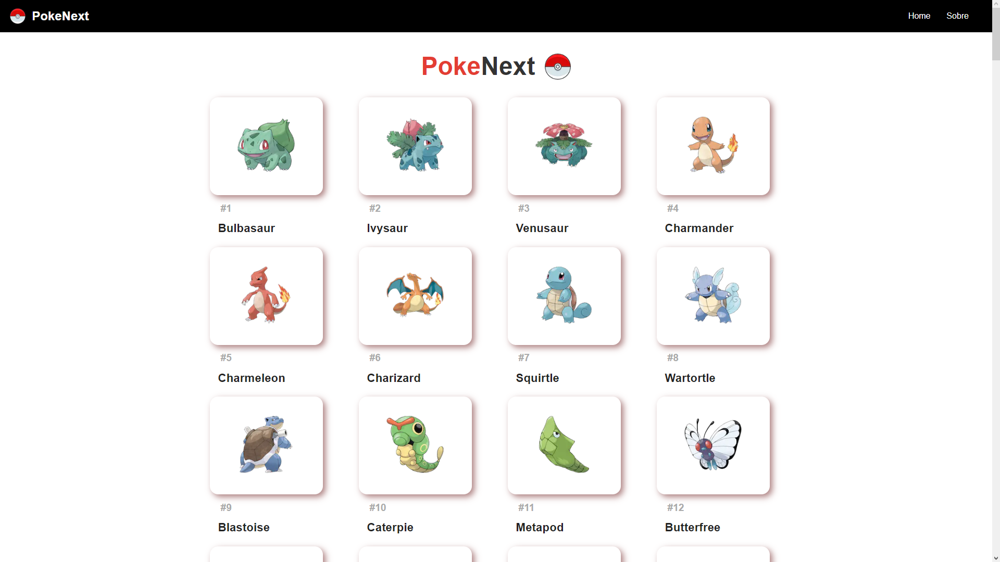

<h1 align="center">
   PokeNext
</h1>

## 
 <u>Preview da página:</u> 

  

> A aplicação funciona como uma pokedex, uma enciclopédia de pokemons

<h4 align="center"><a href="#" target="_blank">Clique para visitar o projeto</a></h4>

---
# 💼 Tecnologias Utilizadas

As seguintes tecnologias foram usadas na construção do projeto:

- React
- Next
- Node
- PokeApi

*Também foram aplicados conceitos de responsividade*

# ⚙️ Instalação

  1. `$ npm install`
  2. `$ npm start`
  

# 🛠️ Funcionalidades

- Listagem de todos os pokemons da primeira geração
- Página individual para cada pokemón, com descrição detalhada

---

### Ajustes e melhorias

O projeto ainda está em desenvolvimento e as próximas atualizações serão voltadas nas seguintes tarefas:

- [ ] Sistema de Busca
- [ ] Paginação
- [ ] Inclusão de todos os pokemóns

---

Feito por Thauã Magalhães 👋🏽 Entre em contato!

 

